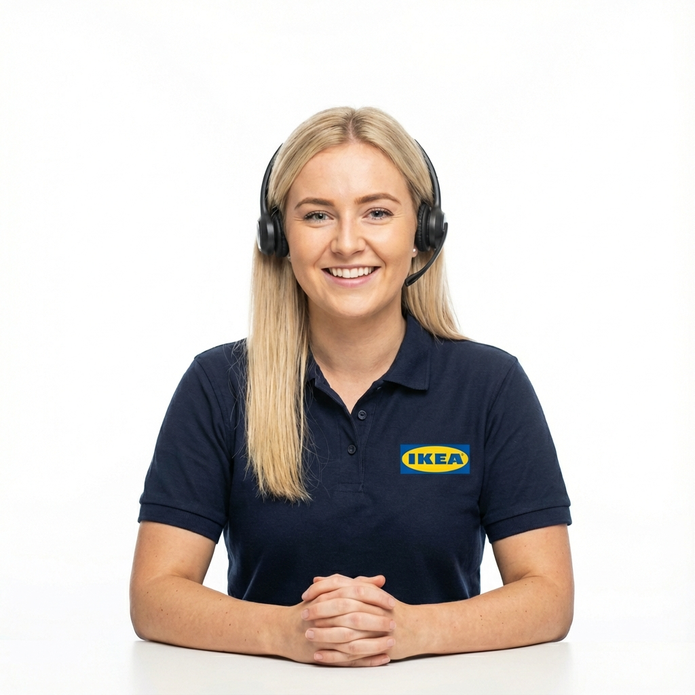

# IKEA AI Support - Voice-Enabled Customer Care



## 🏆 SinceAI Hackathon Submission

An innovative voice-powered customer support solution built with **ElevenLabs Conversational AI**, delivering natural, human-like interactions for IKEA customers seeking assistance with products, assembly, stock checks, and design advice.

## 🌟 Features

- **🎙️ Natural Voice Conversations** - Talk naturally with Sarah, our AI support agent, powered by ElevenLabs' advanced voice technology
- **24/7 Availability** - Round-the-clock customer support without wait times
- **Multi-Purpose Support** - Assistance with assembly instructions, product information, stock availability, and interior design advice
- **Modern UI/UX** - Sleek, futuristic interface built with Tailwind CSS and Shadcn design principles
- **Responsive Design** - Seamlessly works across desktop and mobile devices

## 🚀 Technologies Used

- **ElevenLabs Conversational AI** - Voice interaction and natural language processing
- **PHP** - Backend server
- **Tailwind CSS** - Modern, utility-first styling
- **Shadcn Design System** - Component architecture and theming
- **Custom Animations** - Smooth, engaging user experience

## 🎨 Design Highlights

- IKEA-branded color scheme (Blue #0058A3 and Yellow #FFDB00)
- Futuristic grid animations and ambient glows
- Fixed bottom-right voice widget for easy access
- Professional agent avatar with smooth floating animations
- Dark mode optimized interface

## 💡 Use Cases

1. **Assembly Assistance** - Step-by-step guidance for furniture assembly
2. **Product Information** - Detailed specs, materials, and dimensions
3. **Stock Availability** - Real-time inventory checks
4. **Design Consultation** - Interior design tips and product recommendations
5. **General Support** - Returns, warranties, and customer service queries

## 🛠️ Installation

1. Clone this repository:
```bash
git clone https://github.com/mahbub2649/elevenlabs_extra.git
cd elevenlabs_extra
```

2. Ensure you have PHP installed on your system

3. Place your agent image as `ikea-agent.png` in the root directory

4. Start a local PHP server:
```bash
php -S localhost:8000
```

5. Open your browser and navigate to:
```
http://localhost:8000
```

## ⚙️ Configuration

The ElevenLabs widget is configured with agent ID: `agent_6001kardj7jafqha5m8yk8r5m91k`

To use your own agent:
1. Replace the agent ID in `index.php` (line 194)
2. Update the widget configuration as needed

```html
<elevenlabs-convai agent-id="YOUR_AGENT_ID_HERE"></elevenlabs-convai>
```

## 📱 Widget Position

The ElevenLabs conversational widget is positioned in the bottom-right corner for optimal accessibility and user experience. Custom CSS ensures it stays visible and interactive:

```css
elevenlabs-convai {
    position: fixed !important;
    bottom: 20px !important;
    right: 20px !important;
    z-index: 9999 !important;
}
```

## 🎯 Hackathon Submission

**Event:** SinceAI Hackathon  
**Category:** Customer Service & Support  
**Technology Partner:** ElevenLabs  
**Focus:** Voice-First AI Customer Experience

### Why This Matters

Traditional customer support often involves long wait times and frustrating phone menus. Our solution leverages ElevenLabs' state-of-the-art conversational AI to provide instant, natural voice interactions that understand context, emotion, and intent - delivering a truly human-like support experience.

## 📊 Benefits

- **Reduced Wait Times** - Instant responses to customer queries
- **Cost Efficient** - Scalable support without increasing headcount
- **Improved Satisfaction** - Natural conversations lead to better outcomes
- **Data Insights** - Analytics on common queries and customer needs
- **Multilingual Support** - Easy expansion to multiple languages (ElevenLabs capability)

## 🔮 Future Enhancements

- [ ] Multi-language support
- [ ] Integration with IKEA product database
- [ ] Real-time inventory synchronization
- [ ] Voice-to-AR assembly visualization
- [ ] Personalized recommendations based on conversation history
- [ ] Analytics dashboard for support metrics

## 📄 License

This project is created for the SinceAI Hackathon. All rights reserved.

## 🙏 Acknowledgments

- **ElevenLabs** for providing the conversational AI platform
- **IKEA** for design inspiration
- **SinceAI** for hosting the hackathon

## 👨‍💻 Author

**mahbub2649**  
GitHub: [@mahbub2649](https://github.com/mahbub2649)

---

**Built with ❤️ using ElevenLabs Conversational AI**
